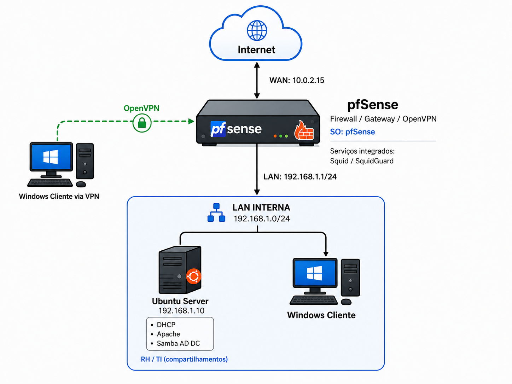

# Topologia da Rede

## Visão geral

A topologia do projeto foi construída para simular uma rede corporativa em ambiente virtualizado, utilizando o pfSense como firewall/gateway principal e o Ubuntu Server como servidor interno da rede.

O ambiente possui uma rede LAN interna, um cliente Windows conectado localmente, um servidor Ubuntu responsável por serviços internos e um cliente Windows externo acessando a rede por meio de uma conexão VPN.

## Diagrama da topologia

## Estrutura da rede

A rede foi organizada com os seguintes componentes principais:

| Componente              | Função                                       | Endereço/Informação                      |
| ----------------------- | -------------------------------------------- | ---------------------------------------- |
| Internet                | Rede externa utilizada para acesso WAN       | —                                        |
| pfSense                 | Firewall, gateway, proxy e servidor VPN      | WAN: `10.0.2.15` / LAN: `192.168.1.1/24` |
| LAN Interna             | Rede local do ambiente corporativo simulado  | `192.168.1.0/24`                         |
| Ubuntu Server           | Servidor interno da rede                     | `192.168.1.10`                           |
| Windows Cliente         | Estação cliente da rede interna              | IP via DHCP                              |
| Windows Cliente via VPN | Cliente externo acessando a rede remotamente | Acesso por OpenVPN                       |

## pfSense

O pfSense foi utilizado como o principal ponto de controle da rede. Ele atua como firewall, gateway da LAN interna, servidor OpenVPN e também hospeda os serviços de proxy e controle de acesso à web.

Principais funções do pfSense no projeto:

* Gateway da rede interna;
* Firewall entre a LAN e a Internet;
* Controle de tráfego;
* Proxy com Squid;
* Filtro de navegação com SquidGuard;
* Autoridade Certificadora interna;
* Servidor OpenVPN.

## Rede LAN interna

A LAN interna utiliza a rede `192.168.1.0/24`, tendo o pfSense como gateway principal no endereço `192.168.1.1`.

Essa rede representa o ambiente interno da empresa, onde estão localizados os clientes e o servidor responsável pelos serviços internos.

## Ubuntu Server

O Ubuntu Server foi configurado com o endereço `192.168.1.10` e atua como servidor interno da rede.

Serviços configurados no Ubuntu Server:

* DHCP Server;
* Apache;
* Samba Active Directory Domain Controller;
* DNS interno;
* Compartilhamentos SMB por departamento.

O servidor fornece serviços essenciais para os clientes da LAN, como distribuição de endereços IP, hospedagem de página web interna, autenticação centralizada e compartilhamento de arquivos.

## Windows Cliente interno

O Windows Cliente representa uma estação de trabalho dentro da rede corporativa. Ele utiliza os serviços disponibilizados pelo Ubuntu Server e acessa a Internet passando pelo pfSense.

Entre os testes realizados com esse cliente, destacam-se:

* Recebimento de IP via DHCP;
* Acesso à Internet através do gateway pfSense;
* Acesso ao servidor Apache;
* Entrada no domínio Samba AD DC;
* Acesso aos compartilhamentos SMB conforme permissões de grupo;
* Validação das políticas de navegação aplicadas pelo proxy.

## Cliente externo via OpenVPN

Também foi configurado um cliente Windows externo para simular o acesso remoto à rede corporativa.

Esse cliente utiliza OpenVPN para estabelecer uma conexão segura com o pfSense, permitindo o acesso controlado aos recursos internos da LAN.

Esse cenário simula uma situação comum em empresas, onde usuários remotos precisam acessar serviços internos de forma segura.

## Fluxo de comunicação

O fluxo principal da rede funciona da seguinte forma:

1. Os clientes da LAN se comunicam com o pfSense como gateway padrão;
2. O pfSense controla o tráfego entre a rede interna e a Internet;
3. O Ubuntu Server fornece serviços internos para os clientes da LAN;
4. O cliente interno acessa serviços como DHCP, Apache, DNS e Samba AD DC;
5. O cliente externo estabelece uma conexão VPN com o pfSense;
6. Após conectado via OpenVPN, o cliente remoto pode acessar recursos permitidos da rede interna.

## Resumo da topologia

A topologia implementada permite simular um ambiente corporativo com firewall, proxy, VPN, servidor interno, autenticação centralizada e controle de acesso a compartilhamentos.

Essa estrutura possibilita testar cenários comuns de administração de redes, segurança perimetral, acesso remoto e gerenciamento de serviços internos em uma infraestrutura empresarial.
