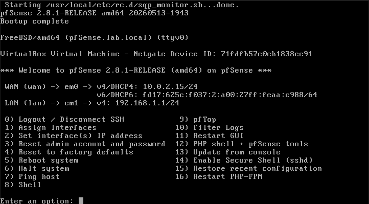
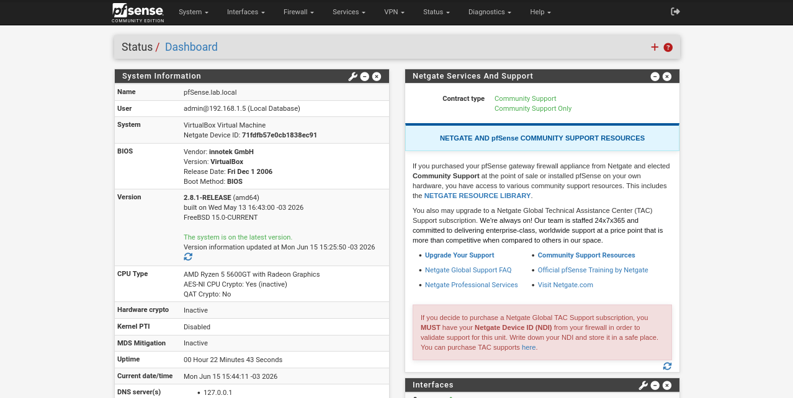
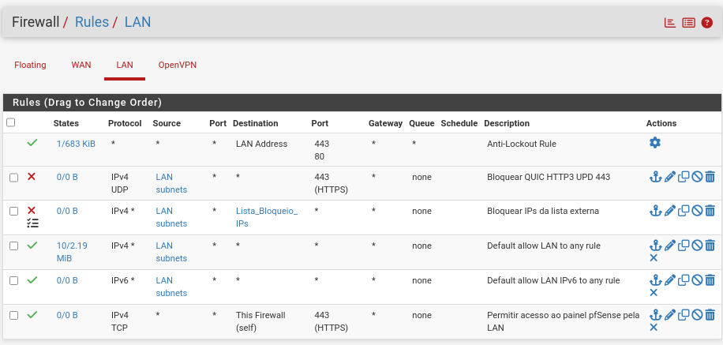
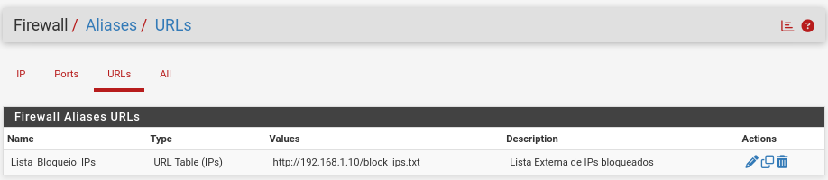

# pfSense

## Função no projeto

O pfSense foi utilizado como firewall, gateway principal da rede, servidor VPN e ponto central de controle de tráfego do ambiente.

No projeto, ele ficou responsável por intermediar a comunicação entre a rede interna e a Internet, aplicar regras de firewall, controlar o tráfego dos clientes, hospedar os serviços de proxy e permitir o acesso remoto seguro por meio da OpenVPN.

## Ambiente de instalação

O pfSense foi instalado em uma máquina virtual no VirtualBox, utilizando duas interfaces de rede:

| Interface | Função                                        | Endereço         |
| --------- | --------------------------------------------- | ---------------- |
| WAN       | Acesso externo/Internet via NAT do VirtualBox | `10.0.2.15`      |
| LAN       | Rede interna do laboratório                   | `192.168.1.1/24` |



> Interfaces configuradas no pfSense, com a WAN conectada ao NAT do VirtualBox e a LAN conectada à rede interna do laboratório.

A rede interna utilizada no projeto foi:

```text
192.168.1.0/24
```

A interface LAN do pfSense atuou como gateway padrão da rede interna, permitindo que os clientes acessassem a Internet e os serviços controlados pelo firewall.

## Papel do pfSense na topologia

Na topologia do projeto, o pfSense fica entre a rede interna e a Internet.

Sua função principal é controlar o tráfego que entra e sai da LAN, além de fornecer serviços de segurança e conectividade para o ambiente.

Principais funções implementadas:

* Firewall da rede;
* Gateway da LAN;
* NAT para acesso à Internet;
* Controle de regras de tráfego;
* Proxy com Squid;
* Filtro de navegação com SquidGuard;
* Autoridade Certificadora interna;
* Servidor OpenVPN.



> Dashboard do pfSense durante o funcionamento do ambiente, centralizando funções de firewall, gateway e serviços de rede.

## NAT e acesso à Internet

O pfSense foi configurado com NAT automático, permitindo que os dispositivos da rede interna acessassem a Internet por meio da interface WAN.

Com essa configuração, os clientes da LAN utilizam o pfSense como gateway, e o tráfego é encaminhado para a Internet através da interface WAN.

Esse comportamento simula o funcionamento comum de uma rede corporativa, onde o firewall centraliza a saída para a Internet e aplica políticas de controle.

## Regras de firewall

Foram mantidas regras básicas na interface LAN para permitir o tráfego necessário dos clientes internos.

Durante o desenvolvimento do projeto, também foram criadas regras adicionais para atender aos requisitos do ambiente:

* Permitir acesso ao painel web do pfSense pela LAN;
* Permitir o tráfego da rede interna para a Internet;
* Permitir acesso ao serviço OpenVPN;
* Permitir comunicação da rede VPN com a LAN interna;
* Bloquear tráfego UDP na porta 443;
* Bloquear IPs externos presentes em uma lista externa.

As regras foram organizadas de acordo com a necessidade do tráfego, mantendo as regras de bloqueio posicionadas acima das regras mais permissivas.



> Regras aplicadas na interface LAN para controlar o tráfego dos clientes internos.

## Bloqueio de QUIC/HTTP3

Uma regra importante criada na interface LAN foi o bloqueio do protocolo QUIC/HTTP3.

Navegadores modernos podem utilizar QUIC sobre UDP na porta 443. Em alguns cenários, isso pode permitir que o navegador contorne parte do controle aplicado pelo proxy HTTP/HTTPS.

Para evitar esse comportamento, foi criada uma regra bloqueando tráfego UDP destinado à porta 443.

Configuração da regra:

| Campo            | Valor                       |
| ---------------- | --------------------------- |
| Interface        | LAN                         |
| Ação             | Block                       |
| Protocolo        | UDP                         |
| Origem           | LAN net                     |
| Destino          | Any                         |
| Porta de destino | 443                         |
| Descrição        | Bloquear QUIC/HTTP3 UDP 443 |

Essa regra foi posicionada acima da regra geral que permite a saída da LAN para a Internet.

## Autoridade Certificadora interna

Foi criada uma Autoridade Certificadora interna no pfSense para ser utilizada nos serviços que dependem de certificados digitais.

A CA criada recebeu o nome:

```text
Lab-CA
```

Também foi criado um certificado de servidor para a OpenVPN:

```text
Lab-VPN-Cert
```

A Autoridade Certificadora `Lab-CA` também foi importada nos clientes para que os navegadores confiassem nos certificados utilizados durante a interceptação HTTPS do Squid.

No Windows, a CA foi importada em:

```text
Autoridades de Certificação Raiz Confiáveis
```

No Firefox, a CA foi importada na área de certificados do próprio navegador, com permissão para identificar sites.

## Lista externa de IPs bloqueados

Um dos requisitos do projeto foi utilizar uma lista externa de IPs para bloqueio no firewall.

Para isso, foi criado um arquivo `.txt` hospedado no servidor Ubuntu contendo os IPs que deveriam ser bloqueados.

Arquivo criado no Ubuntu Server:

```text
/var/www/html/block_ips.txt
```

Endereço utilizado pelo pfSense:

```text
http://192.168.1.10/block_ips.txt
```

Exemplo de conteúdo da lista:

```text
1.1.1.1
9.9.9.9
```

No pfSense, foi criado um Alias do tipo `URL Table (IPs)` apontando para esse arquivo.

Nome do alias:

```text
Lista_Bloqueio_IPs
```



> Alias do tipo URL Table criado para carregar uma lista externa de IPs hospedada no Ubuntu Server.

Em seguida, foi criada uma regra na interface LAN bloqueando o acesso aos IPs presentes nesse alias.

Configuração da regra:

| Campo     | Valor              |
| --------- | ------------------ |
| Interface | LAN                |
| Ação      | Block              |
| Protocolo | Any                |
| Origem    | LAN subnets        |
| Destino   | Lista_Bloqueio_IPs |

O teste foi realizado utilizando ping. Os IPs presentes na lista foram bloqueados, enquanto IPs fora da lista continuaram acessíveis.

## Serviços integrados ao pfSense

Além das funções básicas de firewall e gateway, o pfSense também foi utilizado para hospedar serviços adicionais no ambiente:

| Serviço         | Função                                    |
| --------------- | ----------------------------------------- |
| Squid           | Proxy para controle de navegação          |
| SquidGuard      | Filtro de sites e categorias              |
| OpenVPN         | Acesso remoto seguro à rede interna       |
| CA interna      | Emissão e gerenciamento de certificados   |
| Alias URL Table | Bloqueio de IPs a partir de lista externa |

Esses serviços serão documentados em seções específicas, pois possuem configurações próprias e testes individuais.

## Desafios encontrados

Durante a configuração do pfSense, alguns desafios foram identificados:

* Ajuste das interfaces WAN e LAN no VirtualBox;
* Necessidade de liberar tráfego privado na WAN por se tratar de ambiente de laboratório;
* Redirecionamento de porta no VirtualBox para funcionamento da OpenVPN;
* Bloqueio de QUIC/HTTP3 para evitar bypass do proxy;
* Importação da CA nos clientes para funcionamento adequado da interceptação HTTPS;
* Organização das regras de firewall na ordem correta.

Esses pontos foram resolvidos por meio de ajustes nas interfaces, regras de firewall, certificados, NAT e configurações específicas do ambiente virtualizado.

## Resultado

Ao final da configuração, o pfSense funcionou como o ponto central de segurança e roteamento da rede.

A partir dele, foi possível controlar o tráfego da LAN, permitir acesso à Internet, bloquear IPs externos por lista, integrar serviços de proxy, configurar certificados internos e disponibilizar acesso remoto seguro via OpenVPN.

Essa configuração permitiu simular um cenário corporativo com controle perimetral, filtragem de tráfego, acesso remoto e políticas básicas de segurança.
