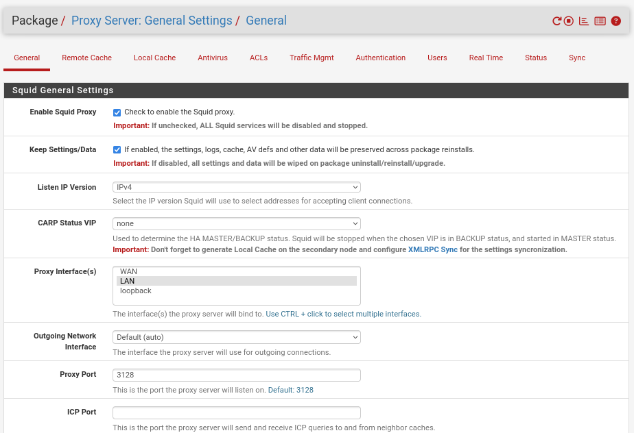
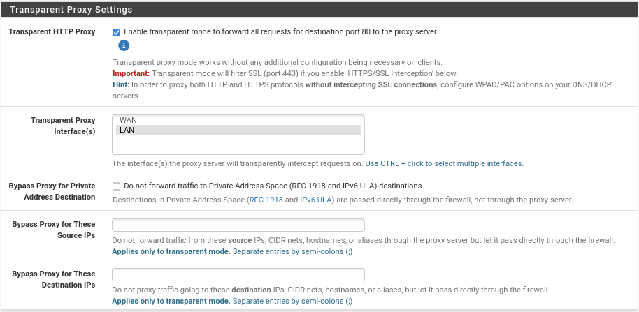
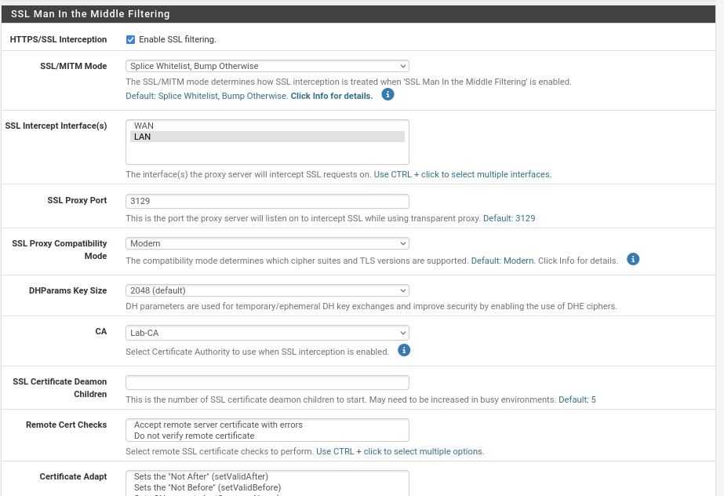
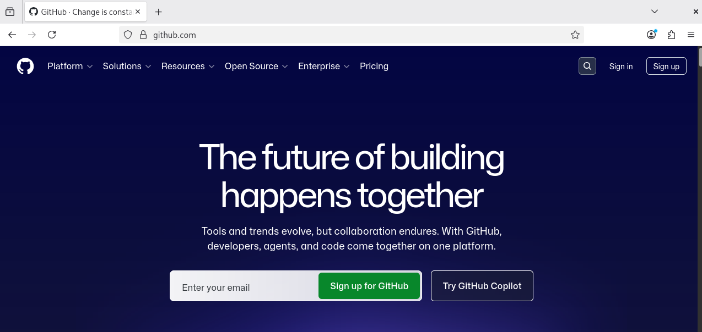

# Squid Proxy

## Função no projeto

O Squid Proxy foi configurado no pfSense para atuar como serviço de proxy da rede interna.

Sua função principal no projeto foi controlar e intermediar o acesso web dos clientes da LAN, permitindo maior visibilidade e controle sobre a navegação dos usuários.

Com o Squid, foi possível aplicar políticas de acesso, registrar navegação, integrar o filtro de conteúdo SquidGuard e preparar o ambiente para controle de tráfego HTTP e HTTPS.

## Papel do Squid na topologia

Na topologia do projeto, o Squid está integrado ao pfSense, que atua como firewall e gateway da rede.

Os clientes da LAN utilizam o pfSense como saída para a Internet. Com o Squid habilitado, o tráfego web passa a ser processado pelo proxy antes de ser encaminhado para os destinos externos.

Esse modelo simula um cenário comum em redes corporativas, onde o acesso à web é controlado por um proxy centralizado.

## Instalação do Squid

O Squid foi instalado diretamente no pfSense por meio do gerenciador de pacotes.

Após a instalação, o serviço foi habilitado e configurado para escutar o tráfego proveniente da interface LAN.

Configurações principais utilizadas:

| Configuração           | Valor       |
| ---------------------- | ----------- |
| Serviço                | Squid Proxy |
| Status                 | Ativado     |
| Interface              | LAN         |
| Proxy HTTP Port        | `3128`      |
| SSL Proxy Port         | `3129`      |
| Transparent HTTP Proxy | Ativado     |
| HTTPS/SSL Interception | Ativado     |
| CA utilizada           | `Lab-CA`    |



> Configuração geral do Squid Proxy no pfSense, com serviço ativo na interface LAN e portas definidas para proxy HTTP e SSL.

## Proxy transparente

Inicialmente, foram realizados testes com configuração manual de proxy no navegador do cliente.

Depois, o Squid foi configurado em modo transparente para o tráfego HTTP. Dessa forma, os clientes da rede interna não precisavam configurar manualmente o endereço do proxy no navegador.

Com o proxy transparente ativado, o tráfego HTTP dos clientes era interceptado automaticamente pelo pfSense e encaminhado para o Squid.



> Proxy transparente ativado para interceptar automaticamente o tráfego HTTP dos clientes da LAN.

Essa abordagem facilita a aplicação do proxy em uma rede corporativa, pois reduz a necessidade de configuração individual em cada estação de trabalho.

## Interceptação HTTPS/SSL

Além do tráfego HTTP, também foi configurada a interceptação HTTPS/SSL.

Essa configuração permite que o Squid analise conexões HTTPS, desde que os clientes confiem na Autoridade Certificadora utilizada pelo pfSense.

A CA utilizada no projeto foi:

```text
Lab-CA
```



> Interceptação HTTPS/SSL configurada no Squid utilizando a Autoridade Certificadora interna `Lab-CA`.

Essa autoridade certificadora foi criada no pfSense e posteriormente importada nos clientes da rede.

## Importação da CA nos clientes

Para que a interceptação HTTPS funcionasse corretamente, foi necessário importar a CA `Lab-CA` nos clientes.

No Windows, a CA foi importada em:

```text
Autoridades de Certificação Raiz Confiáveis
```

No Firefox, a importação foi feita na área de certificados do próprio navegador, habilitando a permissão para identificar sites.

Esse processo foi necessário para evitar alertas de certificado durante a navegação HTTPS interceptada pelo Squid.

## Integração com SquidGuard

O Squid foi utilizado em conjunto com o SquidGuard.

Enquanto o Squid atua como proxy, processando o tráfego web, o SquidGuard aplica políticas de bloqueio e permissão com base em categorias, domínios e listas personalizadas.

A configuração detalhada do SquidGuard será documentada em uma seção própria.

## Bloqueio de QUIC/HTTP3

Durante os testes, foi identificado que navegadores modernos podem utilizar QUIC/HTTP3 sobre UDP na porta `443`.

Esse comportamento poderia permitir que parte do tráfego HTTPS não fosse processada corretamente pelo proxy.

Para evitar isso, foi criada uma regra no firewall bloqueando tráfego UDP com destino à porta `443`.

Resumo da regra:

| Campo            | Valor                       |
| ---------------- | --------------------------- |
| Interface        | LAN                         |
| Ação             | Block                       |
| Protocolo        | UDP                         |
| Origem           | LAN net                     |
| Destino          | Any                         |
| Porta de destino | `443`                       |
| Descrição        | Bloquear QUIC/HTTP3 UDP 443 |

Essa regra foi posicionada acima da regra geral de liberação da LAN para a Internet.

## Testes realizados

Após a configuração do Squid, foram realizados testes para validar o funcionamento do proxy.

Testes executados:

| Teste                         | Resultado esperado                       | Resultado obtido                |
| ----------------------------- | ---------------------------------------- | ------------------------------- |
| Acesso HTTP pelo cliente      | Tráfego processado pelo Squid            | Funcionou                       |
| Acesso HTTPS com CA importada | Navegação sem erro de certificado        | Funcionou após importação da CA |
| Navegação sem proxy manual    | Cliente acessando via proxy transparente | Funcionou                       |
| Acesso à Internet pela LAN    | Navegação permitida                      | Funcionou                       |
| Integração com SquidGuard     | Bloqueios aplicados por categoria        | Funcionou                       |



> Cliente da LAN acessando a Internet com o tráfego processado pelo Squid Proxy.

## Desafios encontrados

Durante a configuração do Squid, alguns desafios foram identificados:

* Necessidade de importar a CA nos clientes;
* Ajustes para funcionamento da interceptação HTTPS;
* Diferença entre proxy manual e proxy transparente;
* Cache dos navegadores durante os testes;
* Uso de QUIC/HTTP3 pelos navegadores;
* Necessidade de bloquear UDP 443 para evitar bypass do proxy.

Esses pontos foram corrigidos com ajustes nas configurações do Squid, importação da CA, limpeza de cache, reset de estados e criação de regra específica no firewall para bloqueio de QUIC/HTTP3.

## Resultado

Ao final da configuração, o Squid Proxy funcionou como serviço central de controle de navegação da rede interna.

O proxy permitiu processar tráfego HTTP e HTTPS, registrar acessos, integrar políticas de bloqueio com o SquidGuard e aumentar o controle sobre a navegação dos clientes.

Essa configuração aproximou o ambiente de um cenário corporativo real, onde o tráfego web dos usuários é monitorado e controlado por uma solução centralizada.