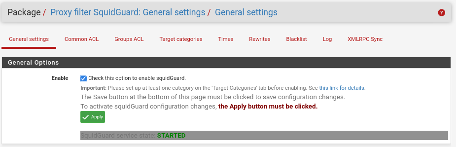
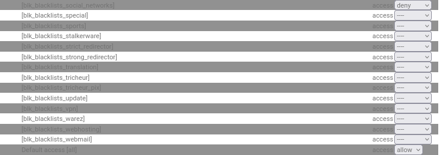
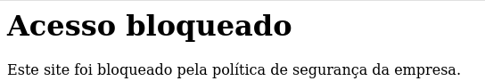
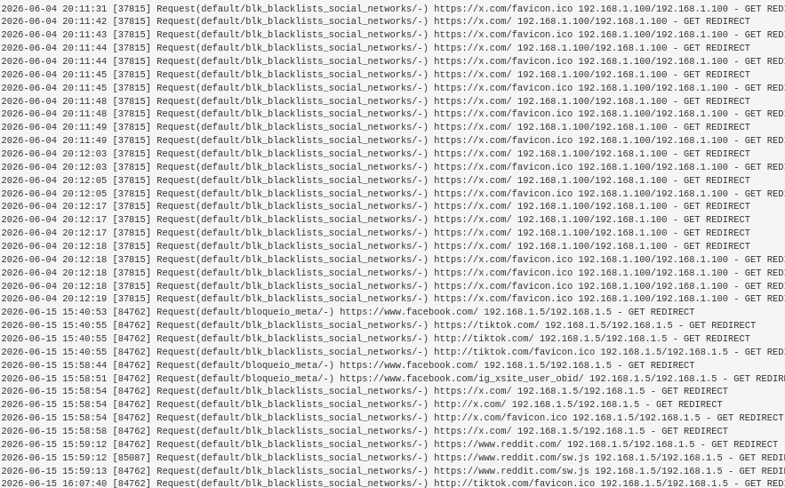
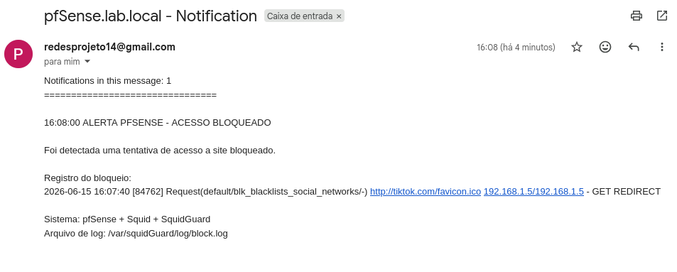
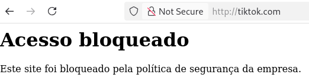
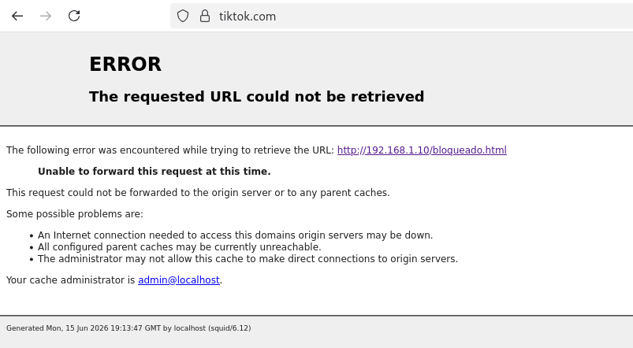

# SquidGuard

## Função no projeto

O SquidGuard foi configurado no pfSense para atuar como filtro de conteúdo web integrado ao Squid Proxy.

Sua função principal foi aplicar políticas de bloqueio e permissão sobre a navegação dos clientes da rede interna, permitindo controlar o acesso a sites e categorias específicas.

No projeto, o SquidGuard foi utilizado para bloquear redes sociais, permitir sites autorizados e redirecionar acessos bloqueados para uma página personalizada.

## Papel do SquidGuard na topologia

Na topologia do projeto, o SquidGuard trabalha em conjunto com o Squid Proxy.

O Squid recebe e processa o tráfego web dos clientes da LAN, enquanto o SquidGuard verifica se o destino acessado está permitido ou bloqueado de acordo com as regras configuradas.

Esse funcionamento simula um cenário corporativo onde a empresa define políticas de navegação para seus usuários.

## Configurações principais

As principais configurações utilizadas no SquidGuard foram:

| Configuração               | Valor      |
| -------------------------- | ---------- |
| Serviço                    | SquidGuard |
| Status                     | Ativado    |
| Blacklist                  | Ativada    |
| Default access             | Allow      |
| Categoria de redes sociais | Deny       |
| Log                        | Ativado    |
| Log rotation               | Ativado    |



> Configuração geral do SquidGuard no pfSense, com blacklist, logs e política padrão de acesso habilitados.

Durante a configuração, foi identificado que o campo `Default access` estava definido como `Deny`, o que bloqueava toda a navegação.

Após o ajuste para `Allow`, a navegação voltou a funcionar normalmente, e apenas as categorias definidas como bloqueadas passaram a ser filtradas.

## Política de acesso

A política de acesso foi organizada com uma lógica simples:

* Sites permitidos explicitamente foram configurados como `allow`;
* Categorias indesejadas foram configuradas como `deny`;
* O acesso padrão foi mantido como `allow`.

Resumo da política:

| Categoria             | Ação  |
| --------------------- | ----- |
| permitidos            | allow |
| social_networks       | deny  |
| bloqueio_manual_redes | deny  |
| default access        | allow |



> Common ACL do SquidGuard com sites permitidos definidos como `allow` e categorias bloqueadas definidas como `deny`.

Essa configuração permite que a navegação geral continue funcionando, enquanto sites ou categorias específicas são bloqueados.

## Categorias bloqueadas

Foram bloqueados sites e categorias relacionados a redes sociais.

Exemplos de serviços bloqueados:

* Facebook;
* Instagram;
* TikTok;
* Reddit;
* X/Twitter;
* Threads.

O bloqueio foi feito utilizando categorias da blacklist e também uma categoria manual para domínios que não eram filtrados corretamente pela lista padrão.

## Categoria manual de bloqueio

Além da blacklist padrão, foi criada uma categoria manual para adicionar domínios específicos.

Essa categoria foi utilizada para bloquear sites que não estavam sendo corretamente identificados pela categoria padrão de redes sociais.

Nome utilizado:

```text
bloqueio_manual_redes
```


> Categoria manual criada para bloquear domínios que não foram filtrados corretamente pela blacklist padrão.

Essa abordagem permitiu maior controle sobre os domínios bloqueados, principalmente em casos onde a blacklist não era suficiente.

## Lista de permissão

Também foi criada uma categoria de sites permitidos no SquidGuard.

Nome da categoria:

```text
permitidos
```

Foram adicionados domínios e serviços autorizados, como:

```text
google.com
www.google.com
lab.local
ubuntusrv.lab.local
```

Essa lista representa sites e serviços que deveriam permanecer acessíveis durante os testes, incluindo o domínio interno do laboratório e o servidor Ubuntu.

No `Common ACL`, a categoria `permitidos` foi configurada como `allow`.

## Página personalizada de bloqueio

Para melhorar a experiência e a visualização dos bloqueios, foi criada uma página personalizada de bloqueio no Ubuntu Server, hospedada pelo Apache.

Arquivo criado:

```text
/var/www/html/bloqueado.html
```

Endereço de acesso:

```text
http://192.168.1.10/bloqueado.html
```

Essa página foi utilizada para informar ao usuário que o acesso ao site foi bloqueado pela política da rede.



> Página personalizada de bloqueio hospedada no Apache do Ubuntu Server.

Em páginas HTTP, o redirecionamento ocorreu corretamente para a página personalizada. Em páginas HTTPS, devido à interceptação SSL/MITM, o navegador podia exibir uma página de erro do Squid, mas o bloqueio era aplicado corretamente.

## Logs do SquidGuard

O SquidGuard foi configurado para registrar tentativas de acesso bloqueado.

Arquivo de log utilizado:

```text
/var/squidGuard/log/block.log
```

Esse arquivo registra informações importantes sobre os bloqueios, como:

* IP do cliente;
* Horário da tentativa;
* Site acessado;
* Categoria bloqueada;
* Ação aplicada.



> Registro de tentativa de acesso bloqueado no arquivo `/var/squidGuard/log/block.log`.

Esses logs foram importantes para validar o funcionamento das regras e também serviram como base para o envio de alertas por e-mail.

## Alertas por e-mail

Foi configurado um mecanismo de alerta por e-mail para notificar o administrador quando uma nova tentativa de acesso bloqueado fosse detectada.

O pfSense foi configurado com envio SMTP utilizando Gmail, e um script em PHP foi criado para verificar o arquivo `block.log`.

O alerta enviado ao administrador continha informações como:

* Horário do bloqueio;
* Site acessado;
* Categoria bloqueada;
* IP do cliente;
* Sistema responsável pelo bloqueio.



> Alerta enviado ao administrador após detecção de uma tentativa de acesso bloqueado.

Esse recurso aproximou o projeto de um cenário mais corporativo, onde eventos de segurança ou violações de política podem gerar notificações para análise.

## Testes realizados

Após a configuração do SquidGuard, foram realizados testes para validar as políticas de navegação.

| Teste                    | Resultado esperado              | Resultado obtido       |
| ------------------------ | ------------------------------- | ---------------------- |
| Acessar Google           | Permitido                       | Funcionou              |
| Acessar YouTube          | Permitido                       | Funcionou              |
| Acessar TikTok           | Bloqueado                       | Bloqueado              |
| Acessar Reddit           | Bloqueado                       | Bloqueado              |
| Acessar Facebook         | Bloqueado                       | Bloqueado após ajustes |
| Acessar Instagram        | Bloqueado                       | Bloqueado após ajustes |
| Acessar X/Twitter        | Bloqueado                       | Bloqueado              |
| Receber e-mail de alerta | E-mail enviado ao administrador | Funcionou              |





> Teste de acesso a site bloqueado, validando a política de navegação aplicada pelo SquidGuard.

## Desafios encontrados

Durante a configuração do SquidGuard, alguns desafios foram encontrados:

* `Default access` configurado inicialmente como `Deny`, bloqueando toda a navegação;
* Alguns sites não eram bloqueados corretamente pela blacklist padrão;
* Necessidade de criar categoria manual de bloqueio;
* Diferença de comportamento entre bloqueios HTTP e HTTPS;
* Necessidade de validar logs para confirmar os bloqueios;
* Cache dos navegadores interferindo em alguns testes.

Esses problemas foram resolvidos ajustando o `Default access` para `Allow`, criando uma categoria manual de bloqueio, validando os logs e realizando novos testes de acesso.

## Resultado

Ao final da configuração, o SquidGuard funcionou como filtro de conteúdo web da rede interna.

Foi possível bloquear categorias e sites específicos, permitir serviços autorizados, registrar tentativas de acesso bloqueado e enviar alertas por e-mail ao administrador.

Essa configuração permitiu simular uma política corporativa de controle de navegação, aumentando o nível de controle e monitoramento sobre o uso da Internet pelos clientes da LAN.
