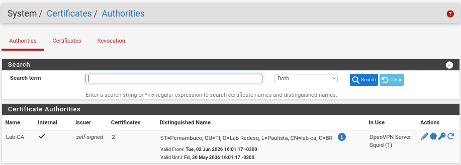
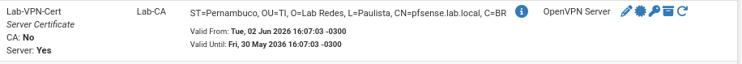
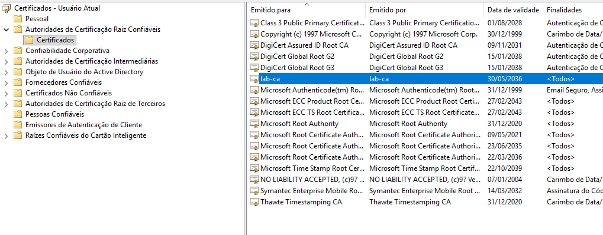

# Autoridade Certificadora

## Função no projeto

A Autoridade Certificadora interna foi criada no pfSense para permitir a emissão e o gerenciamento de certificados digitais utilizados no ambiente do laboratório.

No projeto, a CA teve duas funções principais:

* Dar suporte à interceptação HTTPS/SSL utilizada pelo Squid Proxy;
* Emitir certificados utilizados na configuração da OpenVPN.

Essa configuração simula um cenário corporativo onde a própria organização possui uma autoridade certificadora interna para emitir certificados usados em serviços internos, VPNs e inspeção de tráfego.

## Autoridade Certificadora criada

No pfSense, foi criada uma Autoridade Certificadora interna com o nome:

```text
Lab-CA
```



> Autoridade Certificadora interna `Lab-CA` criada no pfSense para emissão e gerenciamento de certificados no laboratório.

Essa CA foi utilizada como base de confiança para os serviços que dependiam de certificados digitais dentro do ambiente.

## Certificado da OpenVPN

Além da Autoridade Certificadora, também foi criado um certificado de servidor para uso na OpenVPN.

Certificado criado:

```text
Lab-VPN-Cert
```


> Certificado `Lab-VPN-Cert` criado no pfSense para uso no servidor OpenVPN.


Esse certificado foi utilizado pelo servidor OpenVPN configurado no pfSense, permitindo a criação de um túnel seguro entre o cliente externo e a rede interna do laboratório.

## Uso da CA no Squid Proxy

A CA `Lab-CA` também foi utilizada na configuração da interceptação HTTPS/SSL do Squid Proxy.

Como o tráfego HTTPS é criptografado, o Squid precisa utilizar certificados para conseguir realizar a inspeção das conexões HTTPS. Para que isso funcione corretamente, os clientes precisam confiar na Autoridade Certificadora usada pelo proxy.

Por isso, a CA criada no pfSense foi importada nos clientes da rede.

## Importação da CA no Windows

No cliente Windows, a CA foi importada no repositório de certificados confiáveis do sistema.

Local utilizado:

```text
Autoridades de Certificação Raiz Confiáveis
```

Essa importação permite que o Windows reconheça a `Lab-CA` como uma autoridade confiável.



> Autoridade Certificadora `Lab-CA` importada nas Autoridades de Certificação Raiz Confiáveis do Windows.

## Importação da CA no Firefox

Além da importação no Windows, também foi necessário importar a CA diretamente no Firefox.

Isso foi necessário porque o Firefox pode utilizar seu próprio repositório de certificados, separado do repositório do sistema operacional.

Durante a importação no Firefox, foi habilitada a permissão para que a CA pudesse identificar sites.

Essa etapa foi essencial para que o navegador confiasse nos certificados utilizados durante a interceptação HTTPS.

## Relação entre CA, Squid e OpenVPN

A Autoridade Certificadora teve papel central em dois serviços do projeto:

| Serviço     | Uso da CA                                      |
| ----------- | ---------------------------------------------- |
| Squid Proxy | Permitir confiança na interceptação HTTPS/SSL  |
| OpenVPN     | Emitir certificado utilizado pelo servidor VPN |

No Squid, a CA foi necessária para que os clientes confiassem nos certificados apresentados durante a inspeção HTTPS.

Na OpenVPN, a CA foi utilizada para validar os certificados envolvidos na conexão VPN.

## Importância da CA no ambiente

A criação de uma CA interna trouxe mais realismo ao projeto, pois ambientes corporativos frequentemente utilizam certificados próprios para proteger serviços internos, autenticar conexões e controlar o tráfego de rede.

Com a CA configurada, foi possível integrar diferentes serviços do ambiente com uma base comum de confiança.

## Testes realizados

Após a criação e importação da CA, foram realizados testes para validar seu funcionamento.

| Teste                         | Resultado esperado                         | Resultado obtido          |
| ----------------------------- | ------------------------------------------ | ------------------------- |
| Importar CA no Windows        | CA reconhecida como confiável              | Funcionou                 |
| Importar CA no Firefox        | Navegador confiando na CA                  | Funcionou                 |
| Navegação HTTPS com Squid     | Redução de erros de certificado            | Funcionou após importação |
| Uso do certificado na OpenVPN | Servidor VPN utilizando certificado válido | Funcionou                 |

## Desafios encontrados

Durante essa etapa, alguns pontos exigiram atenção:

* Importação correta da CA no Windows;
* Importação separada da CA no Firefox;
* Configuração da permissão para identificar sites no navegador;
* Entendimento da relação entre certificados, proxy HTTPS e VPN;
* Ajustes necessários para que a interceptação HTTPS funcionasse corretamente.

Esses desafios foram resolvidos com a importação da CA nos locais corretos e validação dos testes de navegação e conexão VPN.

## Resultado

Ao final da configuração, a Autoridade Certificadora `Lab-CA` passou a ser utilizada como base de confiança para os serviços do projeto.

Ela permitiu o funcionamento adequado da interceptação HTTPS no Squid Proxy e também foi utilizada na configuração da OpenVPN.

Com isso, o ambiente passou a simular melhor uma infraestrutura corporativa que utiliza certificados digitais para segurança, inspeção de tráfego e acesso remoto.
