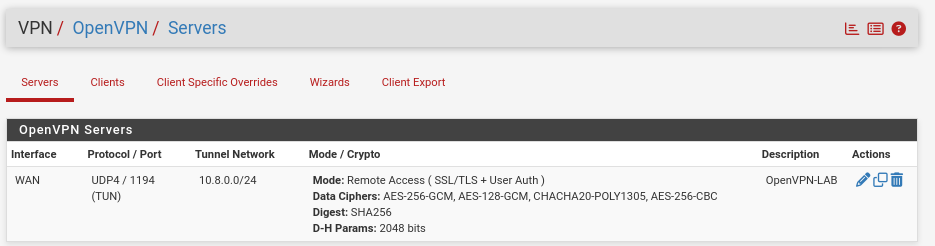
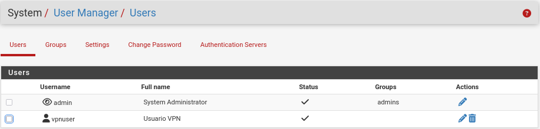
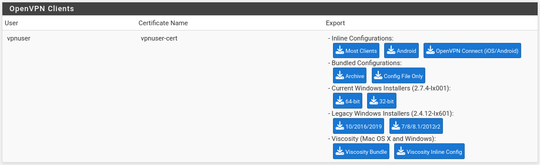
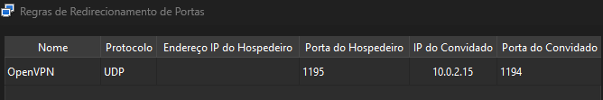
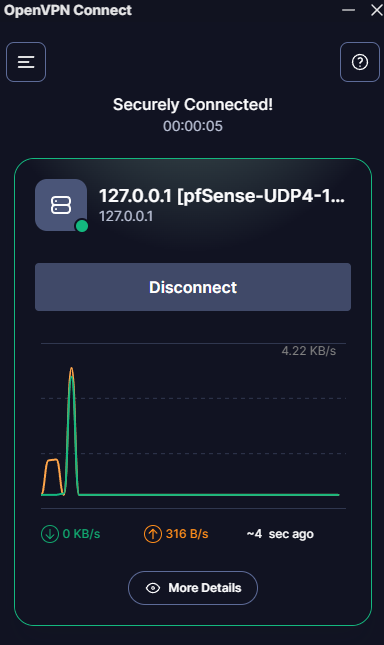
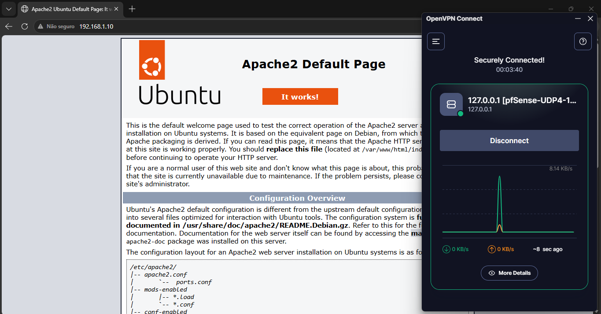
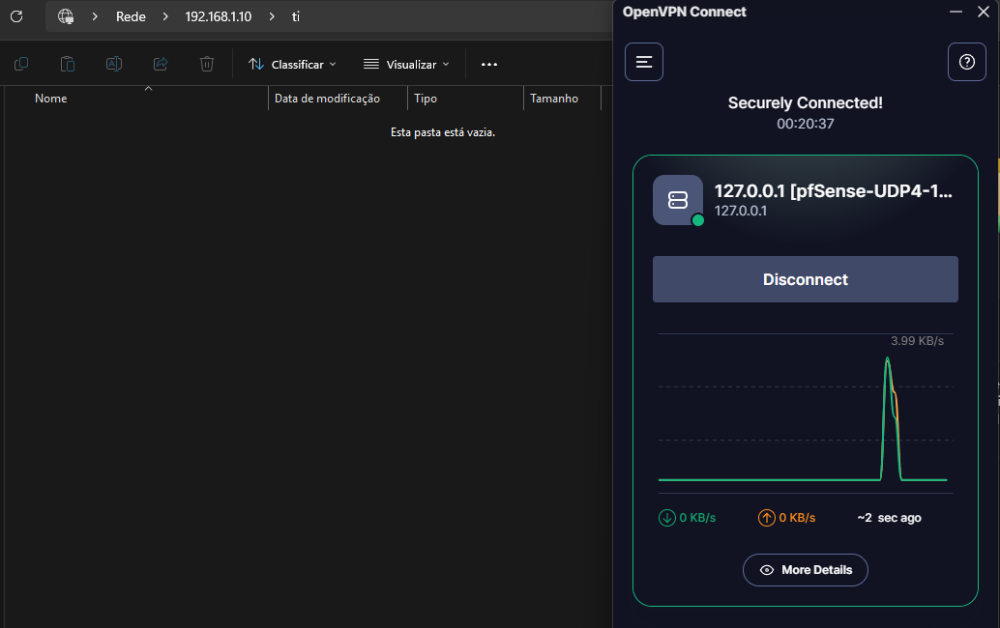

# OpenVPN

## Função no projeto

A OpenVPN foi configurada no pfSense para permitir acesso remoto seguro à rede interna do laboratório.

O objetivo foi simular um cenário corporativo onde um usuário externo precisa acessar recursos internos da empresa, como servidor web, compartilhamentos de arquivos e serviços de rede, por meio de um túnel VPN criptografado.

Com essa configuração, o cliente externo pôde se conectar ao pfSense e acessar a LAN interna de forma controlada.

## Papel da OpenVPN na topologia

Na topologia do projeto, a OpenVPN está configurada no pfSense, que atua como servidor VPN.

O cliente externo estabelece uma conexão com o pfSense pela interface WAN. Após a autenticação, o cliente recebe acesso à rede interna do laboratório, permitindo comunicação com os serviços disponibilizados na LAN.

Rede interna do projeto:

```text
192.168.1.0/24
```

Rede utilizada para o túnel VPN:

```text
10.8.0.0/24
```

## Configuração utilizada

A configuração da OpenVPN foi realizada pelo assistente do pfSense, acessando:

```text
VPN > OpenVPN > Wizards
```

Foram utilizadas as seguintes configurações principais:

| Configuração            | Valor             |
| ----------------------- | ----------------- |
| Tipo de servidor        | Local User Access |
| CA                      | Lab-CA            |
| Certificado do servidor | Lab-VPN-Cert      |
| Interface               | WAN               |
| Protocolo               | UDP               |
| Porta                   | 1194              |
| Tunnel Network          | 10.8.0.0/24       |
| Local Network           | 192.168.1.0/24    |
| DNS Server              | 192.168.1.10      |



> Configuração principal do servidor OpenVPN no pfSense, utilizando UDP na porta `1194`, rede de túnel `10.8.0.0/24` e acesso à rede interna `192.168.1.0/24`.

## Certificados utilizados

A OpenVPN utilizou a Autoridade Certificadora criada anteriormente no pfSense.

CA utilizada:

```text
Lab-CA
```

Certificado do servidor VPN:

```text
Lab-VPN-Cert
```

Esses certificados foram utilizados para garantir a confiança e a segurança da conexão entre o cliente VPN e o servidor OpenVPN.

## Usuário VPN

Foi criado um usuário específico para acesso remoto via VPN.

Usuário criado:

```text
vpnuser
```



> Usuário `vpnuser` criado no pfSense para autenticação no servidor OpenVPN.

Esse usuário recebeu um certificado próprio, permitindo sua autenticação no servidor OpenVPN.

## Exportação do cliente VPN

Para facilitar a configuração do cliente externo, foi instalado no pfSense o pacote:

```text
openvpn-client-export
```

Esse pacote permitiu exportar o arquivo de configuração `.ovpn`, que foi utilizado no cliente Windows externo para estabelecer a conexão com o servidor VPN.



> Exportação do arquivo de configuração `.ovpn` utilizando o pacote `openvpn-client-export`.

## Ajustes no VirtualBox

Como o pfSense estava executando em uma máquina virtual e a interface WAN utilizava NAT do VirtualBox, foi necessário criar um redirecionamento de porta.

O redirecionamento encaminhou uma porta da máquina real para a porta `1194/UDP` da WAN do pfSense.

Esse ajuste foi necessário para permitir que o cliente externo conseguisse alcançar o serviço OpenVPN dentro do ambiente virtualizado.



> Redirecionamento de porta UDP no VirtualBox para permitir acesso ao servidor OpenVPN executando no pfSense virtualizado.

## Ajuste na interface WAN

Também foi necessário desmarcar a opção:

```text
Block private networks
```

Essa opção foi desabilitada na interface WAN do pfSense porque, no laboratório, a WAN estava recebendo um endereço IP privado do NAT do VirtualBox.

Em um ambiente real de produção, essa opção normalmente deve ser analisada com cuidado, pois bloquear redes privadas na WAN pode ser uma medida importante de segurança. No laboratório, porém, a liberação foi necessária para o funcionamento do cenário virtualizado.

## Regras de firewall

Durante a configuração da OpenVPN, foram criadas regras para permitir o funcionamento da VPN e a comunicação com a rede interna.

As regras permitiram:

* Acesso ao serviço OpenVPN pela interface WAN;
* Comunicação da rede VPN com a LAN interna;
* Acesso do cliente VPN aos serviços internos autorizados.

Essas regras foram essenciais para que o cliente remoto pudesse alcançar o pfSense e, após conectado, acessar os recursos da rede `192.168.1.0/24`.

## Testes realizados

Após a configuração da OpenVPN, foram realizados testes para validar o acesso remoto à rede interna.

| Teste                     | Resultado esperado                          | Resultado obtido |
| ------------------------- | ------------------------------------------- | ---------------- |
| Conectar cliente OpenVPN  | Conexão estabelecida                        | Funcionou        |
| Ping para o pfSense       | Resposta de `192.168.1.1`                   | Funcionou        |
| Ping para o Ubuntu Server | Resposta de `192.168.1.10`                  | Funcionou        |
| Acesso ao Apache          | Página acessível via `http://192.168.1.10`  | Funcionou        |
| Acesso ao Samba           | Compartilhamento acessível com autenticação | Funcionou        |



> Cliente externo conectado com sucesso à OpenVPN, recebendo acesso à rede interna do laboratório.

## Acesso ao Apache pela VPN

Com a VPN conectada, o cliente externo conseguiu acessar o servidor Apache hospedado no Ubuntu Server.

Endereço testado:

```text
http://192.168.1.10
```



> Acesso ao servidor Apache interno através da conexão OpenVPN.

Esse teste confirmou que o cliente VPN conseguia alcançar serviços web internos da rede.

## Acesso ao Samba pela VPN

Também foi testado o acesso ao compartilhamento Samba do Ubuntu Server.

Caminho utilizado:

```text
\\192.168.1.10\compartilhado
```



> Acesso ao compartilhamento Samba pela OpenVPN com autenticação de usuário do domínio.

O acesso solicitou autenticação de usuário do domínio. Após informar credenciais válidas, o compartilhamento foi acessado com sucesso.

Esse teste validou que a OpenVPN permitiu acesso remoto não apenas ao servidor, mas também a serviços internos protegidos por autenticação.

## Desafios encontrados

Durante a configuração da OpenVPN, alguns desafios foram identificados:

* Funcionamento do pfSense atrás do NAT do VirtualBox;
* Necessidade de redirecionamento da porta UDP `1194`;
* Ajuste da opção `Block private networks` na WAN;
* Configuração correta da rede de túnel;
* Liberação de tráfego entre a rede VPN e a LAN;
* Exportação e uso correto do arquivo `.ovpn` no cliente.

Esses desafios foram resolvidos com ajustes no VirtualBox, nas regras do pfSense e na configuração da OpenVPN.

## Resultado

Ao final da configuração, a OpenVPN permitiu que um cliente externo acessasse a rede interna do laboratório de forma segura.

A conexão VPN foi estabelecida com sucesso, e o cliente remoto conseguiu acessar o pfSense, o Ubuntu Server, o Apache e os compartilhamentos Samba.

Essa etapa simulou um cenário real de acesso remoto corporativo, onde usuários autorizados acessam recursos internos da empresa por meio de um túnel criptografado.
