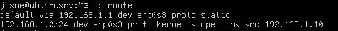
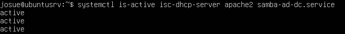
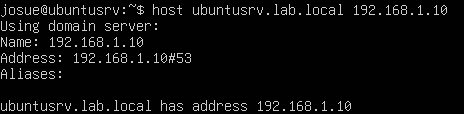
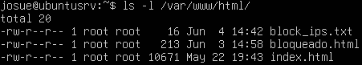

# Ubuntu Server

## Função no projeto

O Ubuntu Server foi utilizado como servidor interno da rede corporativa simulada.

Sua função foi fornecer serviços essenciais para os clientes da LAN, como distribuição de endereços IP, hospedagem web, DNS interno, autenticação centralizada e compartilhamento de arquivos por departamento.

Enquanto o pfSense atuou como firewall, gateway e ponto de controle da rede, o Ubuntu Server ficou responsável pelos serviços internos utilizados pelos clientes.

## Papel do Ubuntu Server na topologia

Na topologia do projeto, o Ubuntu Server está conectado à rede LAN interna, utilizando o endereço IP fixo:

```text
192.168.1.10
```


> Ubuntu Server configurado com IP fixo `192.168.1.10` na rede interna do laboratório.

A rede interna utilizada no ambiente foi:

```text
192.168.1.0/24
```

O gateway padrão da rede é o pfSense:

```text
192.168.1.1
```

Dessa forma, o Ubuntu Server fornece serviços para os clientes internos, enquanto o pfSense controla a saída para a Internet e o acesso remoto via VPN.

## Serviços configurados

No Ubuntu Server, foram configurados os seguintes serviços:

| Serviço               | Função                                                   |
| --------------------- | -------------------------------------------------------- |
| DHCP Server           | Distribuição automática de endereços IP para os clientes |
| Apache                | Hospedagem de páginas web internas                       |
| Samba AD DC           | Controlador de domínio Active Directory                  |
| DNS interno           | Resolução de nomes do domínio interno                    |
| Compartilhamentos SMB | Pastas de rede separadas por departamento                |



> Serviços principais ativos no Ubuntu Server, incluindo DHCP, Apache e Samba AD DC.

Além desses serviços, o Ubuntu também hospedou arquivos utilizados por recursos configurados no pfSense, como a página personalizada de bloqueio e a lista externa de IPs bloqueados.

## Endereçamento do servidor

O Ubuntu Server foi configurado com IP fixo para garantir que os serviços internos estivessem sempre acessíveis pelos clientes da rede.

| Configuração      | Valor            |
| ----------------- | ---------------- |
| Endereço IP       | `192.168.1.10`   |
| Rede              | `192.168.1.0/24` |
| Gateway           | `192.168.1.1`    |
| Função do gateway | pfSense          |
| Domínio interno   | `lab.local`      |

O uso de IP fixo foi importante porque serviços como DHCP, DNS, Apache e Samba AD DC precisam estar disponíveis em um endereço conhecido dentro da rede.

## DHCP Server

O Ubuntu Server foi configurado como servidor DHCP da rede interna.

Sua função foi entregar automaticamente endereços IP para os clientes da LAN, mantendo o pfSense como gateway padrão.

Com isso, os clientes recebiam as configurações necessárias para se comunicar na rede e acessar a Internet por meio do pfSense.

A documentação detalhada do DHCP será apresentada em uma seção própria.

## Apache

O Apache foi utilizado para hospedar páginas web internas do laboratório.

Entre os conteúdos hospedados, destacam-se:

* Página web interna de teste;
* Página personalizada de bloqueio do SquidGuard;
* Arquivo `.txt` contendo lista externa de IPs bloqueados pelo pfSense.

A página personalizada de bloqueio foi hospedada em:

```text
/var/www/html/bloqueado.html
```

Endereço de acesso:

```text
http://192.168.1.10/bloqueado.html
```

Também foi hospedado o arquivo de lista externa de IPs:

```text
/var/www/html/block_ips.txt
```

Endereço utilizado pelo pfSense:

```text
http://192.168.1.10/block_ips.txt
```

## Samba Active Directory Domain Controller

O Samba AD DC foi configurado para simular um controlador de domínio em ambiente corporativo.

Domínio utilizado:

```text
lab.local
```

Servidor:

```text
ubuntusrv.lab.local
```



> Teste de resolução de nomes internos do domínio `lab.local` utilizando o DNS do Ubuntu Server.

Com o Samba AD DC, foi possível simular autenticação centralizada, criação de usuários, grupos e controle de acesso a compartilhamentos de rede.

## Compartilhamentos por departamento

Foram criados compartilhamentos SMB para representar setores internos da empresa.

Departamentos simulados:

| Departamento | Grupo   |
| ------------ | ------- |
| RH           | `GG_RH` |
| TI           | `GG_TI` |

Pastas utilizadas:

```text
/srv/samba/departamentos/RH
/srv/samba/departamentos/TI
```

As permissões foram aplicadas de forma que cada grupo tivesse acesso apenas ao seu respectivo departamento.

Esse cenário permitiu validar o controle de acesso baseado em grupos, simulando uma necessidade comum em redes corporativas.

## DNS interno

O DNS interno foi utilizado em conjunto com o Samba AD DC para permitir a resolução de nomes do domínio `lab.local`.

Esse serviço foi importante para o funcionamento correto do domínio, autenticação e localização dos serviços internos.

Exemplos de nomes utilizados no ambiente:

```text
lab.local
ubuntusrv.lab.local
```

## Integração com o pfSense

O Ubuntu Server também foi integrado a recursos configurados no pfSense.

Exemplos dessa integração:

| Recurso no Ubuntu | Uso no pfSense                                            |
| ----------------- | --------------------------------------------------------- |
| `bloqueado.html`  | Página personalizada exibida em bloqueios do SquidGuard   |
| `block_ips.txt`   | Lista externa de IPs usada em Alias do pfSense            |
| DNS interno       | Servidor DNS entregue para clientes e usado na VPN        |
| Apache            | Hospedagem de recursos internos acessíveis pela LAN e VPN |
| Samba             | Serviço acessado por clientes internos e pela OpenVPN     |



> Arquivos hospedados no Apache do Ubuntu Server utilizados pelo pfSense, incluindo a página de bloqueio e a lista externa de IPs.

Essa integração tornou o ambiente mais próximo de uma rede corporativa real, onde firewall e servidores internos trabalham em conjunto.

## Testes realizados

Após a configuração do Ubuntu Server, foram realizados testes para validar os serviços internos.

| Teste                                 | Resultado esperado                | Resultado obtido |
| ------------------------------------- | --------------------------------- | ---------------- |
| Cliente receber IP via DHCP           | IP entregue automaticamente       | Funcionou        |
| Acessar Apache pela LAN               | Página interna acessível          | Funcionou        |
| Acessar página de bloqueio            | Página carregada pelo navegador   | Funcionou        |
| pfSense consumir lista externa de IPs | Alias atualizado com a lista      | Funcionou        |
| Resolver nomes internos               | Domínio interno funcionando       | Funcionou        |
| Acessar compartilhamento Samba        | Solicitação de autenticação       | Funcionou        |
| Usuário RH acessar pasta RH           | Acesso permitido                  | Funcionou        |
| Usuário RH acessar pasta TI           | Acesso negado                     | Funcionou        |
| Usuário TI acessar pasta TI           | Acesso permitido                  | Funcionou        |
| Usuário TI acessar pasta RH           | Acesso negado                     | Funcionou        |
| Acessar Apache pela VPN               | Acesso permitido                  | Funcionou        |
| Acessar Samba pela VPN                | Acesso permitido com autenticação | Funcionou        |

## Desafios encontrados

Durante a configuração do Ubuntu Server, alguns pontos exigiram maior atenção:

* Configuração do IP fixo do servidor;
* Integração entre DHCP e gateway pfSense;
* Configuração do DNS interno para o domínio;
* Ajustes do Samba AD DC;
* Criação de grupos e permissões por departamento;
* Permissões Linux nas pastas compartilhadas;
* Validação de acesso com usuários diferentes;
* Hospedagem de arquivos utilizados pelo pfSense.

Esses desafios foram resolvidos com ajustes na configuração dos serviços, permissões de diretórios e testes práticos com os clientes da rede.

## Resultado

Ao final da configuração, o Ubuntu Server funcionou como o servidor interno principal do ambiente.

Ele forneceu serviços de DHCP, Apache, DNS interno, Samba AD DC e compartilhamentos SMB, além de hospedar arquivos utilizados pelo pfSense.

Essa etapa permitiu simular uma infraestrutura corporativa com serviços internos centralizados, autenticação por domínio e controle de acesso a recursos compartilhados.
