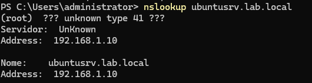
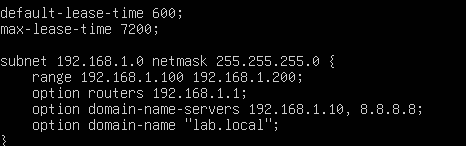
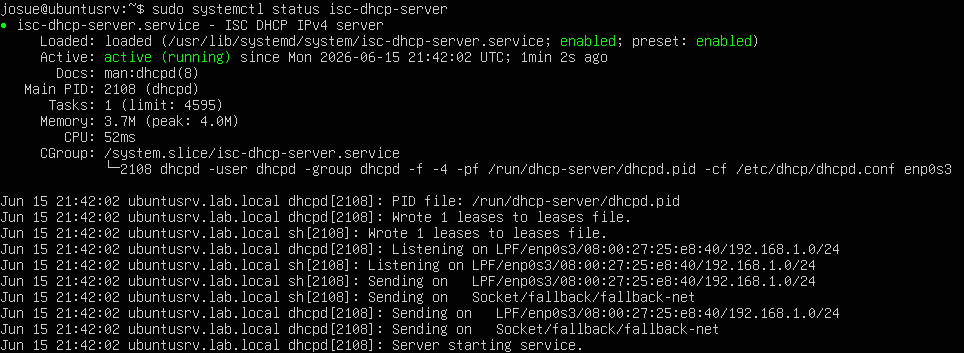
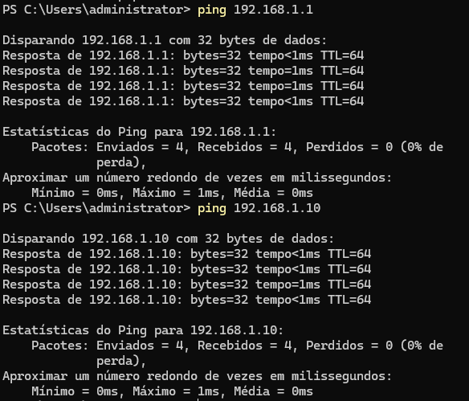
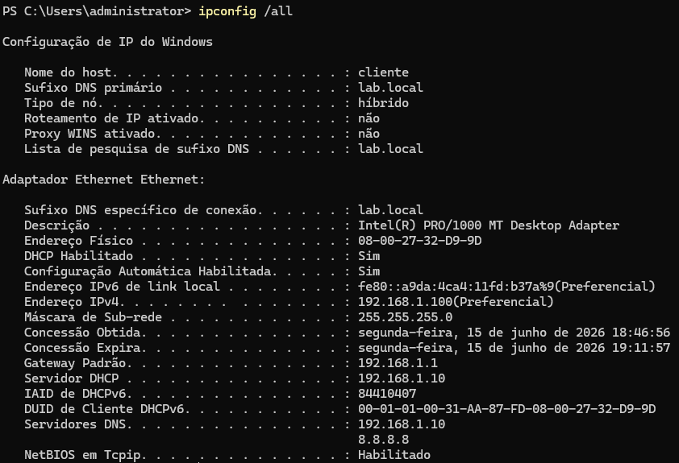

# DHCP Server

## Função no projeto

O DHCP Server foi configurado no Ubuntu Server para realizar a distribuição automática de endereços IP aos clientes da rede interna.

No projeto, o DHCP teve a função de entregar as configurações básicas de rede para as estações da LAN, permitindo que os clientes se comunicassem com os demais dispositivos, acessassem serviços internos e utilizassem o pfSense como gateway para acesso à Internet.

## Papel do DHCP na topologia

Na topologia do projeto, o Ubuntu Server atua como servidor DHCP da rede interna.

Endereço do Ubuntu Server:

```text
192.168.1.10
```

Rede interna utilizada:

```text
192.168.1.0/24
```

Gateway da rede:

```text
192.168.1.1
```

O gateway da rede é o pfSense, enquanto o serviço DHCP é fornecido pelo Ubuntu Server.

Essa separação simula um ambiente corporativo onde o firewall controla a saída da rede, mas os serviços internos são centralizados em um servidor dedicado.

## Configuração geral

O DHCP foi configurado para atender os clientes da LAN, entregando endereços dentro da faixa definida para a rede interna.

Pool DHCP utilizada:

```text
192.168.1.100 - 192.168.1.200
```

Configurações entregues aos clientes:

| Configuração    | Valor                           |
| --------------- | ------------------------------- |
| Rede            | `192.168.1.0/24`                |
| Faixa DHCP      | `192.168.1.100 - 192.168.1.200` |
| Gateway padrão  | `192.168.1.1`                   |
| Servidor DHCP   | `192.168.1.10`                  |
| DNS primário    | `192.168.1.10`                  |
| DNS secundário  | `8.8.8.8`                       |
| Domínio interno | `lab.local`                     |


## Gateway entregue aos clientes

Mesmo o DHCP estando no Ubuntu Server, o gateway entregue aos clientes foi o pfSense.

Gateway padrão:

```text
192.168.1.1
```

Isso significa que os clientes recebiam IP automaticamente pelo Ubuntu Server, mas todo o tráfego de saída para a Internet passava pelo pfSense.

Esse funcionamento é importante porque mantém o pfSense como ponto central de controle, firewall, proxy e roteamento da rede.

## DNS entregue aos clientes

Como o ambiente utiliza Samba Active Directory Domain Controller, o DNS interno tem papel essencial no funcionamento do domínio.

Por esse motivo, o DNS primário entregue aos clientes pelo DHCP foi o próprio Ubuntu Server:

```text
192.168.1.10
```

Esse servidor é responsável pela resolução dos nomes internos do domínio `lab.local`, permitindo que os clientes localizem corretamente o controlador de domínio e demais serviços internos.

Também foi configurado um DNS secundário externo:

```text
8.8.8.8
```

O DNS secundário foi utilizado como alternativa para resolução de nomes externos, enquanto o DNS primário permaneceu responsável pela resolução do domínio interno.

Configuração de DNS utilizada:

| Tipo            | Endereço       | Função                             |
| --------------- | -------------- | ---------------------------------- |
| DNS primário    | `192.168.1.10` | DNS interno do domínio/Samba AD DC |
| DNS secundário  | `8.8.8.8`      | Resolução externa alternativa      |
| Domínio interno | `lab.local`    | Domínio do ambiente                |

Essa configuração foi importante para garantir que os clientes conseguissem resolver tanto nomes internos, como `ubuntusrv.lab.local`, quanto domínios externos da Internet.



> Cliente resolvendo o nome interno `ubuntusrv.lab.local` utilizando o DNS entregue pelo DHCP.

## Exemplo de configuração

A configuração do DHCP foi feita no arquivo do serviço DHCP do Ubuntu Server.

Exemplo de estrutura da configuração:

```bash
subnet 192.168.1.0 netmask 255.255.255.0 {
    range 192.168.1.100 192.168.1.200;
    option routers 192.168.1.1;
    option domain-name "lab.local";
    option domain-name-servers 192.168.1.10, 8.8.8.8;
}
```



> Configuração do DHCP Server no Ubuntu, definindo faixa de IPs, gateway pfSense, domínio interno e servidores DNS.

Nessa configuração:

* `range` define a faixa de IPs entregues aos clientes;
* `option routers` define o gateway padrão, que é o pfSense;
* `option domain-name` define o domínio interno;
* `option domain-name-servers` define os servidores DNS entregues aos clientes;
* `192.168.1.10` é o DNS interno do Ubuntu/Samba AD DC;
* `8.8.8.8` foi utilizado como DNS secundário para resolução externa.



> Serviço DHCP ativo no Ubuntu Server, responsável por entregar configurações de rede aos clientes da LAN.

## Funcionamento esperado

Quando um cliente Windows é conectado à rede interna, ele solicita automaticamente um endereço IP.

O Ubuntu Server responde à solicitação DHCP e entrega as configurações necessárias para o cliente participar da rede.

Fluxo esperado:

1. Cliente entra na rede LAN;
2. Cliente solicita configuração via DHCP;
3. Ubuntu Server entrega IP dentro da faixa configurada;
4. Cliente recebe gateway `192.168.1.1`;
5. Cliente utiliza o pfSense para acessar a Internet;
6. Cliente utiliza o DNS interno para resolver nomes do domínio.

## Testes realizados

Após a configuração do DHCP, foram realizados testes em um cliente Windows da LAN.

| Teste                                | Resultado esperado       | Resultado obtido |
| ------------------------------------ | ------------------------ | ---------------- |
| Cliente solicitar IP automaticamente | Receber IP da faixa DHCP | Funcionou        |
| Verificar gateway recebido           | Gateway `192.168.1.1`    | Funcionou        |
| Verificar DNS recebido               | DNS interno do domínio   | Funcionou        |
| Testar comunicação com pfSense       | Ping para `192.168.1.1`  | Funcionou        |
| Testar comunicação com Ubuntu Server | Ping para `192.168.1.10` | Funcionou        |
| Testar acesso à Internet             | Navegação via pfSense    | Funcionou        |



> Teste de conectividade do cliente com o gateway pfSense `192.168.1.1` e com o Ubuntu Server `192.168.1.10`.

## Validação no cliente

No cliente Windows, a configuração recebida pode ser validada com o comando:

```cmd
ipconfig /all
```



> Cliente Windows recebendo IP automaticamente via DHCP, com gateway `192.168.1.1` e DNS interno `192.168.1.10`.

Esse comando permite verificar informações como:

* Endereço IPv4 recebido;
* Máscara de rede;
* Gateway padrão;
* Servidor DHCP;
* Servidor DNS;
* Sufixo DNS do domínio.

## Importância no projeto

O DHCP foi essencial para automatizar a configuração dos clientes da rede.

Sem o DHCP, cada cliente precisaria ser configurado manualmente com endereço IP, gateway, DNS e demais informações de rede.

Com o serviço ativo no Ubuntu Server, o ambiente ficou mais próximo de uma infraestrutura corporativa real, onde estações de trabalho recebem suas configurações automaticamente ao ingressarem na rede.

## Desafios encontrados

Durante a configuração do DHCP, alguns pontos exigiram atenção:

* Garantir que o Ubuntu Server estivesse com IP fixo;
* Evitar conflito entre DHCP do pfSense e DHCP do Ubuntu;
* Entregar o gateway correto para os clientes;
* Integrar o DHCP com o DNS interno;
* Validar se os clientes estavam recebendo IP da faixa correta.

Esses pontos foram resolvidos mantendo o DHCP centralizado no Ubuntu Server e configurando o pfSense apenas como gateway da rede.

## Resultado

Ao final da configuração, o Ubuntu Server passou a distribuir endereços IP automaticamente para os clientes da LAN.

Os clientes receberam IP dentro da faixa definida, utilizaram o pfSense como gateway e conseguiram acessar os serviços internos e a Internet.

Essa configuração validou o funcionamento do DHCP no ambiente e reforçou a separação de funções entre o firewall pfSense e o servidor interno Ubuntu.