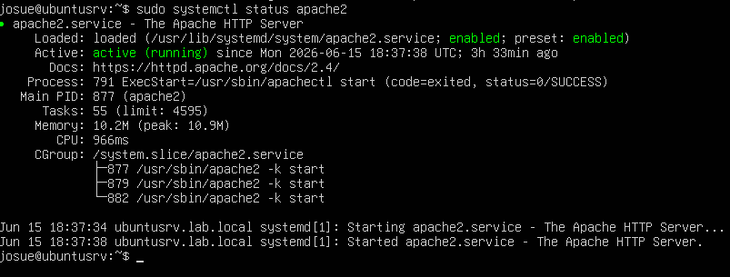
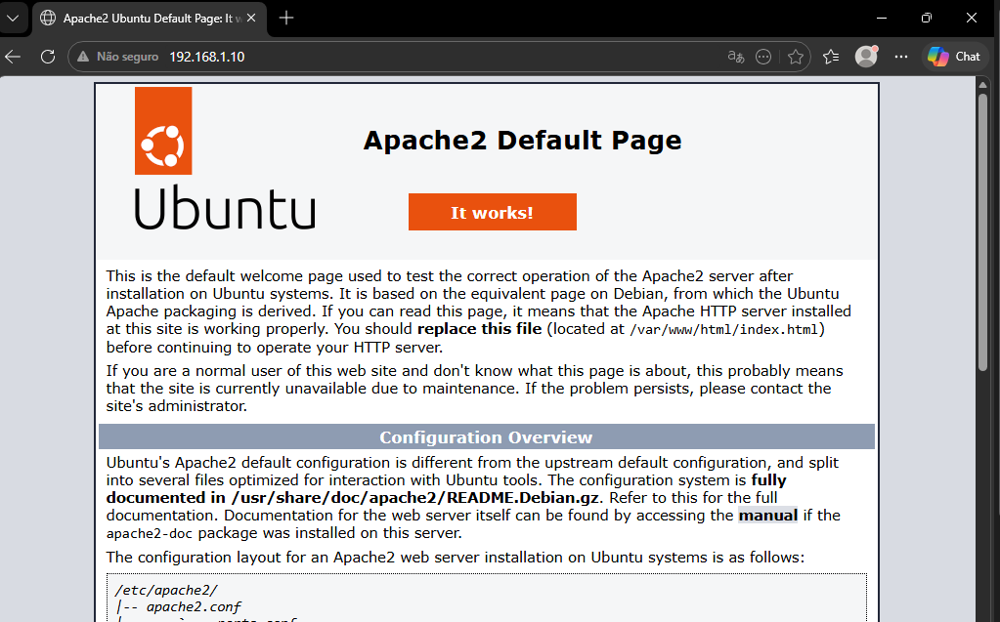

# Apache

## Função no projeto

O Apache foi configurado no Ubuntu Server para atuar como servidor web interno da rede corporativa simulada.

No projeto, ele foi utilizado para hospedar páginas e arquivos acessíveis pelos clientes da LAN e também pelo pfSense.

Além de servir uma página web interna de teste, o Apache também hospedou recursos utilizados por outras partes do projeto, como a página personalizada de bloqueio do SquidGuard e a lista externa de IPs utilizada em uma regra de firewall no pfSense.

## Papel do Apache na topologia

Na topologia do projeto, o Apache está instalado no Ubuntu Server, localizado na rede interna.

Endereço do Ubuntu Server:

```text
192.168.1.10
```

Rede interna:

```text
192.168.1.0/24
```

O Apache ficou acessível para os clientes da LAN e também para clientes conectados remotamente pela OpenVPN.

Endereço principal de acesso:

```text
http://192.168.1.10
```

## Instalação do Apache

O Apache foi instalado no Ubuntu Server para disponibilizar conteúdos web dentro da rede interna.

Após a instalação, o serviço foi iniciado e configurado para responder às requisições HTTP vindas dos clientes da LAN.



> Serviço Apache ativo no Ubuntu Server, responsável por hospedar páginas e arquivos internos do laboratório.

Com isso, foi possível validar se os clientes conseguiam acessar serviços internos hospedados no servidor Ubuntu.

## Diretório web utilizado

Os arquivos web foram armazenados no diretório padrão do Apache:

```text
/var/www/html/
```

Esse diretório foi utilizado para hospedar:

* Página inicial de teste;
* Página personalizada de bloqueio;
* Arquivo com lista externa de IPs bloqueados.

## Página interna de teste

Foi criada uma página web simples para validar o funcionamento do Apache na rede interna.

Essa página permitiu confirmar que o Ubuntu Server estava respondendo corretamente às requisições HTTP dos clientes.

Endereço de acesso:

```text
http://192.168.1.10
```



> Página web interna hospedada no Apache e acessada por um cliente da LAN.

Esse teste foi importante para validar a comunicação entre os clientes da LAN e o servidor interno.

## Página personalizada de bloqueio

O Apache também foi utilizado para hospedar uma página personalizada de bloqueio usada pelo SquidGuard.

Arquivo criado:

```text
/var/www/html/bloqueado.html
```

Endereço de acesso:

```text
http://192.168.1.10/bloqueado.html
```

Essa página foi configurada para ser exibida quando um usuário tentasse acessar sites bloqueados pelas políticas do SquidGuard.

Em acessos HTTP, o redirecionamento para a página personalizada ocorreu corretamente. Em acessos HTTPS, devido à interceptação SSL/MITM, o navegador podia exibir uma página de erro do Squid, mas o bloqueio ainda era aplicado corretamente.

## Lista externa de IPs bloqueados

Outro uso importante do Apache foi hospedar uma lista externa de IPs bloqueados pelo pfSense.

Arquivo criado:

```text
/var/www/html/block_ips.txt
```

Endereço utilizado pelo pfSense:

```text
http://192.168.1.10/block_ips.txt
```

Exemplo de conteúdo do arquivo:

```text
1.1.1.1
9.9.9.9
```

Esse arquivo foi utilizado no pfSense por meio de um Alias do tipo `URL Table (IPs)`.

Nome do alias criado no pfSense:

```text
Lista_Bloqueio_IPs
```

Com essa configuração, o pfSense passou a consultar a lista hospedada no Apache e bloquear os IPs presentes no arquivo.

## Integração com o pfSense

O Apache foi integrado ao pfSense em dois pontos principais:

| Recurso hospedado no Apache | Uso no pfSense                                 |
| --------------------------- | ---------------------------------------------- |
| `bloqueado.html`            | Página personalizada de bloqueio do SquidGuard |
| `block_ips.txt`             | Lista externa de IPs usada em Alias do pfSense |

Essa integração tornou o ambiente mais dinâmico, pois arquivos hospedados no servidor interno passaram a ser utilizados por serviços de segurança configurados no firewall.

## Acesso pela OpenVPN

Após a configuração da OpenVPN, também foi testado o acesso ao Apache a partir de um cliente externo conectado pela VPN.

Endereço testado:

```text
http://192.168.1.10
```

O acesso funcionou corretamente, validando que o cliente VPN conseguia alcançar serviços internos da rede.

Esse teste ajudou a confirmar o funcionamento da comunicação entre a rede VPN e a LAN.

## Testes realizados

Após a configuração do Apache, foram realizados testes para validar o funcionamento do serviço.

| Teste                             | Resultado esperado                | Resultado obtido |
| --------------------------------- | --------------------------------- | ---------------- |
| Acessar página interna pela LAN   | Página carregada no navegador     | Funcionou        |
| Acessar `bloqueado.html`          | Página de bloqueio exibida        | Funcionou        |
| Acessar `block_ips.txt`           | Lista de IPs exibida no navegador | Funcionou        |
| pfSense consultar `block_ips.txt` | Alias atualizado com IPs da lista | Funcionou        |
| Acessar Apache pela OpenVPN       | Página acessível pela VPN         | Funcionou        |

## Validação no navegador

A validação principal foi feita acessando os endereços hospedados no Apache pelo navegador do cliente.

Endereços testados:

```text
http://192.168.1.10
http://192.168.1.10/bloqueado.html
http://192.168.1.10/block_ips.txt
```

Esses testes confirmaram que o Apache estava disponível na rede interna e que os arquivos hospedados podiam ser consumidos tanto por usuários quanto pelo pfSense.

## Desafios encontrados

Durante essa etapa, alguns pontos exigiram atenção:

* Garantir que o Ubuntu Server estivesse acessível pela rede;
* Validar se o Apache estava ativo;
* Confirmar o caminho correto dos arquivos em `/var/www/html/`;
* Testar o acesso aos arquivos pelo navegador;
* Garantir que o pfSense conseguisse acessar o arquivo `block_ips.txt`;
* Validar o acesso ao Apache por clientes conectados via OpenVPN.

Esses pontos foram resolvidos com testes de conectividade, validação pelo navegador e integração com o pfSense.

## Resultado

Ao final da configuração, o Apache funcionou como servidor web interno do projeto.

Ele permitiu hospedar uma página de teste, uma página personalizada de bloqueio para o SquidGuard e uma lista externa de IPs consumida pelo pfSense.

Essa configuração ajudou a simular um ambiente corporativo onde servidores internos fornecem recursos para usuários e também para serviços de segurança da rede.
