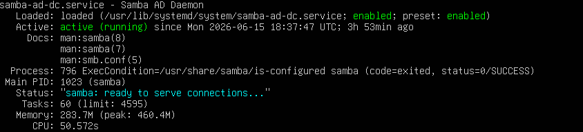
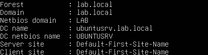
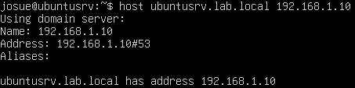
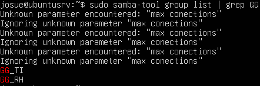
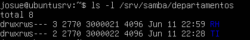
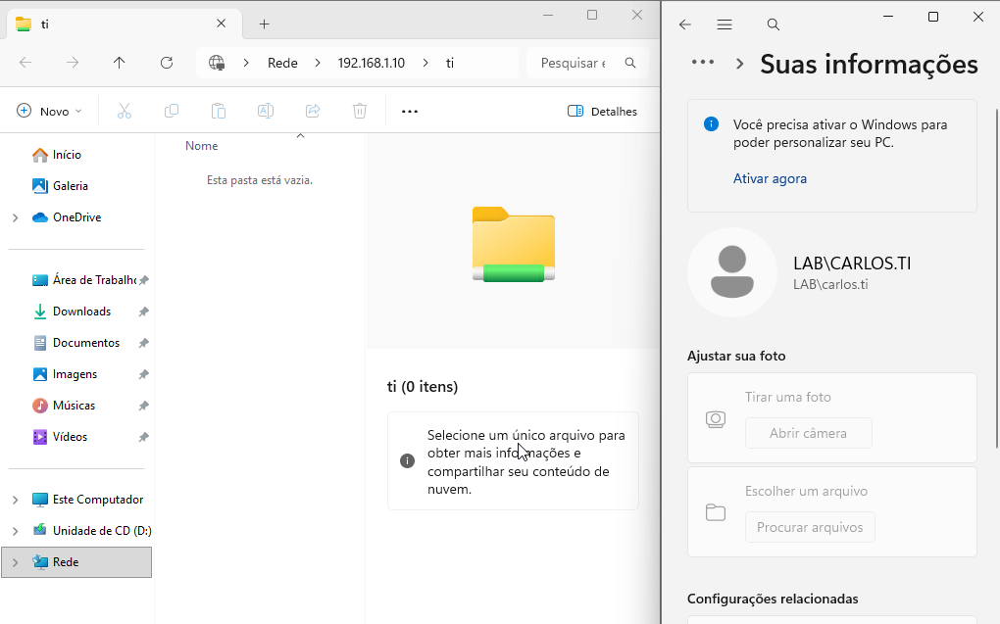
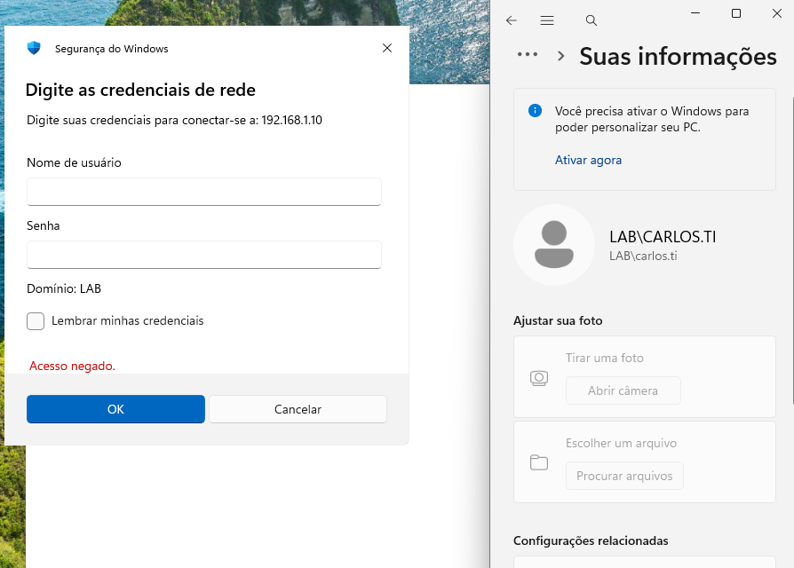

# Samba Active Directory Domain Controller

## Função no projeto

O Samba Active Directory Domain Controller foi configurado no Ubuntu Server para simular um ambiente corporativo com autenticação centralizada, domínio interno, grupos de usuários e controle de acesso a compartilhamentos de rede.

No projeto, o Samba AD DC permitiu criar uma estrutura semelhante a um Active Directory, possibilitando que usuários fossem organizados por grupos e recebessem permissões de acesso de acordo com seus departamentos.

## Papel do Samba AD DC na topologia

Na topologia do projeto, o Samba AD DC está instalado no Ubuntu Server, localizado na rede interna.

Endereço do Ubuntu Server:

```text
192.168.1.10
```

Domínio utilizado:

```text
lab.local
```

Nome do servidor:

```text
ubuntusrv.lab.local
```

O servidor atua como controlador de domínio e também como DNS interno do ambiente, permitindo que os clientes resolvam nomes do domínio e acessem os recursos internos corretamente.



> Serviço Samba AD DC ativo no Ubuntu Server, atuando como controlador de domínio da rede interna.

## Domínio interno

O domínio configurado no ambiente foi:

```text
lab.local
```



> Domínio interno `lab.local` configurado no Samba AD DC.

Esse domínio foi utilizado para simular uma rede corporativa onde usuários, grupos e computadores podem ser gerenciados de forma centralizada.

Com o domínio configurado, os clientes da rede passaram a utilizar o Ubuntu Server como referência para autenticação e resolução de nomes internos.

## DNS interno

O Samba AD DC depende do DNS interno para funcionar corretamente.

Por isso, o Ubuntu Server também foi utilizado como servidor DNS principal da rede, com o endereço:

```text
192.168.1.10
```

Esse DNS foi responsável por resolver nomes relacionados ao domínio `lab.local`, como:

```text
ubuntusrv.lab.local
```



> Resolução do nome `ubuntusrv.lab.local` utilizando o DNS interno do Samba AD DC.

No DHCP, os clientes receberam o Ubuntu Server como DNS primário para garantir a resolução correta dos nomes internos do domínio.

## Estrutura de grupos

Foram criados grupos para representar departamentos da empresa simulada.

| Grupo   | Departamento | Permissão         |
| ------- | ------------ | ----------------- |
| `GG_RH` | RH           | Acesso à pasta RH |
| `GG_TI` | TI           | Acesso à pasta TI |



> Grupos `GG_RH` e `GG_TI` criados para representar os departamentos da empresa simulada.

Essa estrutura permitiu aplicar permissões de acesso baseadas em grupos, uma prática comum em ambientes corporativos.

## Compartilhamentos SMB

Foram criados compartilhamentos SMB separados por departamento.

Pastas criadas no servidor:

```text
/srv/samba/departamentos/RH
/srv/samba/departamentos/TI
```



> Diretórios dos departamentos RH e TI criados no Ubuntu Server para compartilhamento via SMB.

Cada pasta foi associada ao grupo correspondente, permitindo que apenas usuários autorizados acessassem os arquivos do seu departamento.

## Permissões aplicadas

As permissões foram aplicadas utilizando proprietário, grupo e permissões Linux nos diretórios compartilhados.

Exemplo de permissões aplicadas:

```bash
sudo chown -R root:3000021 /srv/samba/departamentos/RH
sudo chmod -R 2770 /srv/samba/departamentos/RH

sudo chown -R root:3000022 /srv/samba/departamentos/TI
sudo chmod -R 2770 /srv/samba/departamentos/TI
```

A permissão `2770` foi utilizada para permitir acesso total ao proprietário e ao grupo, bloquear acesso de outros usuários e manter a herança de grupo nos arquivos criados dentro dos diretórios.

## Lógica de acesso

A lógica de acesso foi organizada da seguinte forma:

| Usuário/Grupo             | Pasta RH  | Pasta TI  |
| ------------------------- | --------- | --------- |
| Usuários do grupo `GG_RH` | Permitido | Bloqueado |
| Usuários do grupo `GG_TI` | Bloqueado | Permitido |

Essa configuração garante que cada departamento acesse somente os arquivos relacionados à sua área.

## Acesso pelos clientes Windows

Os clientes Windows acessaram os compartilhamentos SMB utilizando o endereço do servidor Ubuntu.

Exemplo de acesso:

```text
\\192.168.1.10
```

Também foi testado o acesso direto aos compartilhamentos, como:

```text
\\192.168.1.10\RH
\\192.168.1.10\TI
```

Ao tentar acessar os compartilhamentos, o Windows solicitou autenticação. Após informar credenciais válidas do domínio, o acesso foi liberado ou negado conforme o grupo do usuário.



> Usuário do grupo `GG_TI` acessando com sucesso o compartilhamento do departamento TI.

## Acesso pela OpenVPN

Também foi validado o acesso aos compartilhamentos Samba por meio da OpenVPN.

Após conectar o cliente externo à VPN, foi possível acessar o servidor interno:

```text
\\192.168.1.10
```

O acesso ao compartilhamento solicitou autenticação de usuário do domínio. Após informar credenciais válidas, o recurso foi acessado conforme as permissões configuradas.

Esse teste confirmou que a VPN permitiu acesso remoto aos serviços internos protegidos por autenticação.

## Testes realizados

Após a configuração do Samba AD DC e dos compartilhamentos, foram realizados testes para validar o controle de acesso.

| Teste                                           | Resultado esperado         | Resultado obtido |
| ----------------------------------------------- | -------------------------- | ---------------- |
| Usuário RH acessar pasta RH                     | Permitido                  | Funcionou        |
| Usuário RH criar/modificar arquivos na pasta RH | Permitido                  | Funcionou        |
| Usuário RH acessar pasta TI                     | Bloqueado                  | Acesso negado    |
| Usuário TI acessar pasta TI                     | Permitido                  | Funcionou        |
| Usuário TI criar/modificar arquivos na pasta TI | Permitido                  | Funcionou        |
| Usuário TI acessar pasta RH                     | Bloqueado                  | Acesso negado    |
| Cliente acessar compartilhamento pela VPN       | Permitido com autenticação | Funcionou        |



> Teste de acesso negado ao tentar acessar um compartilhamento sem pertencer ao grupo autorizado.

## Validação das permissões

A validação das permissões foi feita testando usuários pertencentes a grupos diferentes.

O objetivo foi garantir que:

* Usuários do RH acessassem apenas a pasta RH;
* Usuários da TI acessassem apenas a pasta TI;
* Usuários sem permissão recebessem acesso negado;
* Arquivos criados dentro das pastas mantivessem as permissões corretas;
* O acesso remoto via VPN respeitasse as mesmas regras de autenticação.

## Desafios encontrados

Durante a configuração do Samba AD DC, alguns pontos exigiram maior atenção:

* Configuração correta do domínio interno;
* Uso do DNS interno para resolução do domínio;
* Criação e organização dos grupos;
* Associação correta entre grupos e diretórios;
* Ajuste das permissões Linux;
* Validação de acesso com usuários diferentes;
* Testes de acesso a partir da LAN e da OpenVPN.

Esses desafios foram resolvidos com ajustes no DNS, revisão das permissões dos diretórios e testes práticos com usuários dos grupos RH e TI.

## Resultado

Ao final da configuração, o Samba AD DC funcionou como controlador de domínio da rede interna.

Foi possível simular autenticação centralizada, resolução de nomes internos, grupos por departamento e controle de acesso a compartilhamentos SMB.

A configuração permitiu representar um cenário corporativo real, onde usuários acessam recursos de rede conforme suas permissões e seu departamento.
